<h1 align="center">GoodiesByBobo Website</h1>

[View the live project here](https://mariusmilitaru32.github.io/GoodiesByBobo/)

GoodiesByBobo is a business that primarly sells home made cookies and cakes.I created a website for my friend's business because I believe in her passion and the quality of her products. As someone who has sampled her delicious cookies firsthand, I know that they are truly exceptional and deserve to be shared with a wider audience. I also believe that a website can help my friend's business stand out in a competitive market. With so many options for consumers to choose from, having a well-designed and user-friendly website can make all the difference in attracting new customers and building brand loyalty.

## Index – Table of Contents
- [Index – Table of Contents](#index--table-of-contents)
- [User Experience (UX)](#user-experience-ux)
- [Features](#features)
- [Design](#design)
- [Technologies Used](#technologies-used)
- [Testing](#testing)
- [Deployment](#deployment)
- [Bugs](#bugs)
- [Unfixed bugs](#unfixed-bugs)
- [Credits](#credits)
- [Acknowledgements](#acknowledgements)

## User Experience (UX)

- ### User stories

  -   #### A. First Time Visitor 

        1. As a first time visitor, I want to easily understand the main purpose of the site.
        2. As a first time visitor, I want to be able to easily navigate throughout the site to find content.
        3. As a first time visitor, I want to be able to easily view a gallery page.
        4. As a first time visitor, I want to be able to easily find how I can get in contact with the business owner.

   -   #### B. Returning Visitor 

        1. As a returning visitor, I want to be able to send a quick feedback to the business owner.
        2. As a returning visitor, I want to be able to check new products images.
        3. As a returning visitor, I want to be able to contact the business owner through email or phone.

    -  #### C. Website Administrator
        1. As a website administrator, I would like to easy update new and existing products.
        2. As a website administrator, I would like to easy update customer reviews
        3. As a website administrator, I would like to easy get contacted by email, phone or contact form.
   
## Features

   - ### Navigation bar
     - The navigation bar is an essential component of a website's user interface, as it helps users navigate the site and find the content they are looking for quickly and easily. The navbar consist of logo text and links to all three pages (home,gallery and contact). 
  
  -  ### Footer
     - The footer is present on all three pages and consist of follow us text and four icons linked to the social business accounts, providing users an easy access to the newest updates. 
    
  - ### Home page
    - The home page inludes an hero image with a linear gradient to highlight the welcome text, the business purpose and a contact button to give the user the possibility to contact the business owner
  
    - Products offers can been seen right under hero image where this section contains three collums with images and a short description for each type of product the business can offer.
  
    - Homepage customer reviews section can be found under products offer, they provide a valuabe feedback on the products. They help to establish trust with potential customers and can influence their purchasing decision. 
  
  - ### Gallery Page
    - The gallery page has a simple design with a responsive layout using three breakpoints, starting with three collums for large devices like laptops and wide monitors, two collums for medium devices and one collum for smartphones 
 
  - ### Contact page
    - Contact form can be found on contact page. I have include a Contact us header with the following required fields: first name, last name, email address, message/feedback for the business owner and the submit button which create a pull requested to the subbmited page after the form has been successfully submitted.
  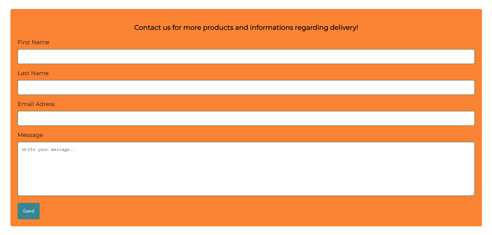
    - Email, Phone Number and Address with gogole maps iframe can be found under the contact form. Features like mailto and tel have been used for an easy contact when using a smarthphone.
  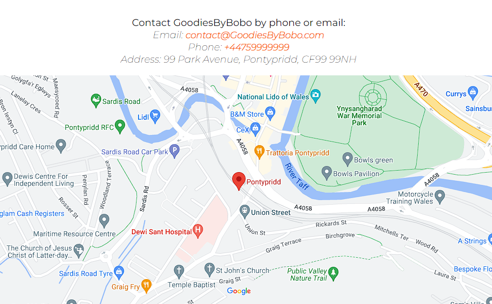
- ### Submitted page
   - This page has been used as a confirmation for the contact form. 
  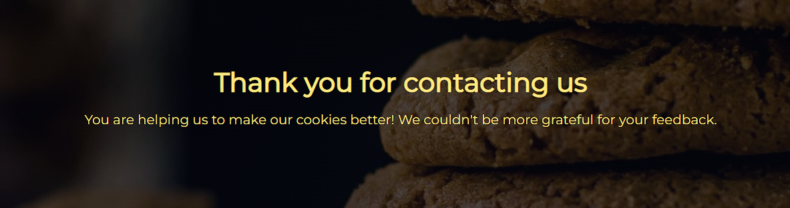

## Design
- ### Color scheme
  - The business owner has requested blue, orange and yellow as main colors for the website. I used [coolors.co](https://coolors.co/) to generate my colour palette.
  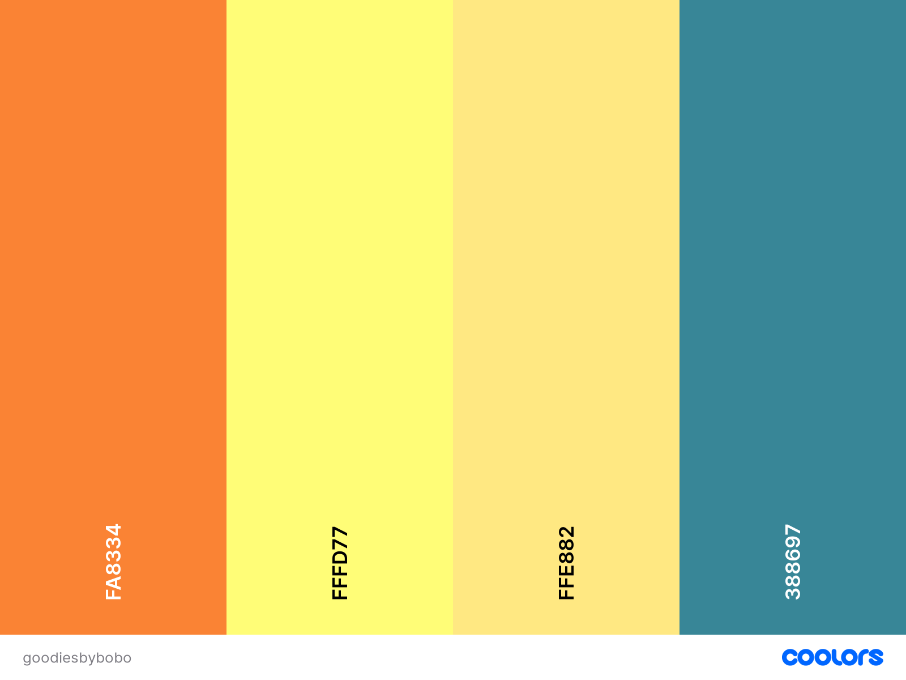

- ### Typography
  - Google Fonts were used to import Montserrat into style.css

- ### Wireframes 
   - Home page  
     [Home page desktop](documentation/index-desktop.png) 
     [Home page mobile](documentation/index-mobile.png)
   - Gallery page  
     [Gallery page desktop](documentation/gallery-desktop.png) 
     [Gallery page mobile](documentation/gallery-mobile.png)
   - Contact page  
     [Contact page desktop](documentation/contact.desktop.png) 
     [Contact page mobile](documentation/contact-mobile.png)
   - Submitted page  
     [Submitted page desktop](documentation/submitted-wf-desktop.png) 
     [Submitted page mobile](documentation/submitted-wf-mobile.png)

## Technologies Used

 - ### Languages Used

   -   [HTML5](https://en.wikipedia.org/wiki/HTML5)
   -   [CSS3](https://en.wikipedia.org/wiki/Cascading_Style_Sheets)

 - ### Frameworks, Libraries and Programs Used

   -   [Google Fonts:](https://fonts.google.com/) was used to import the 'Monsserat' font into the style.css file 
   -   [Font Awesome:](https://fontawesome.com/) was used to add icons for social links.
   -   [Git:](https://git-scm.com/) was used for version control by utilising VSCode terminal to commit to Git and Push to GitHub.
   -   [GitHub:](https://github.com/) was used as the respository for the projects code after being pushed from Git.
   -   [Visual Studio Code](https://code.visualstudio.com/) was used as IDE editor.
   -   [Balsamiq:](https://balsamiq.com/) was used to create the wireframes.
 
 ## Testing

  - ### Validator Testing

    - [HTML Validator](https://validator.w3.org/)
    - [HTML results home page](https://validator.w3.org/nu/?doc=https%3A%2F%2Fmariusmilitaru32.github.io%2FGoodiesByBobo%2Findex.html)
    - [HTML results gallery page](https://validator.w3.org/nu/?doc=https%3A%2F%2Fmariusmilitaru32.github.io%2FGoodiesByBobo%2Fgallery.html)
    - [HTML results contact page](https://validator.w3.org/nu/?doc=https%3A%2F%2Fmariusmilitaru32.github.io%2FGoodiesByBobo%2Fcontact.html)
    - [HTML results submitted page](https://validator.w3.org/nu/?doc=https%3A%2F%2Fmariusmilitaru32.github.io%2FGoodiesByBobo%2Fsubmitted.html)

   - [CSS Validator](https://jigsaw.w3.org/css-validator/)
  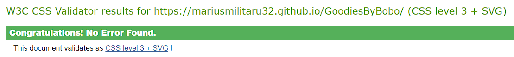
  - [Full CSS Validation here](https://jigsaw.w3.org/css-validator/validator?uri=https%3A%2F%2Fmariusmilitaru32.github.io%2FGoodiesByBobo%2F&profile=css3svg&usermedium=all&warning=1&vextwarning=&lang=en)    

- ### Browser Compatibility

  - Testing has been carried out on the following browsers :
    - Chrome Version 111.0.5563.146 (Relase date: 2023-03-28) (64-bit)
    - Firefox Version 109.0 (Relase date: January 17, 2023) (64-bit)
    - Edge Version 111.0.1661.54 (Relase date: March 24, 2023) (64-bit)
    - I could not test it on safari because I am using Windows
- ### Manual testing and results
  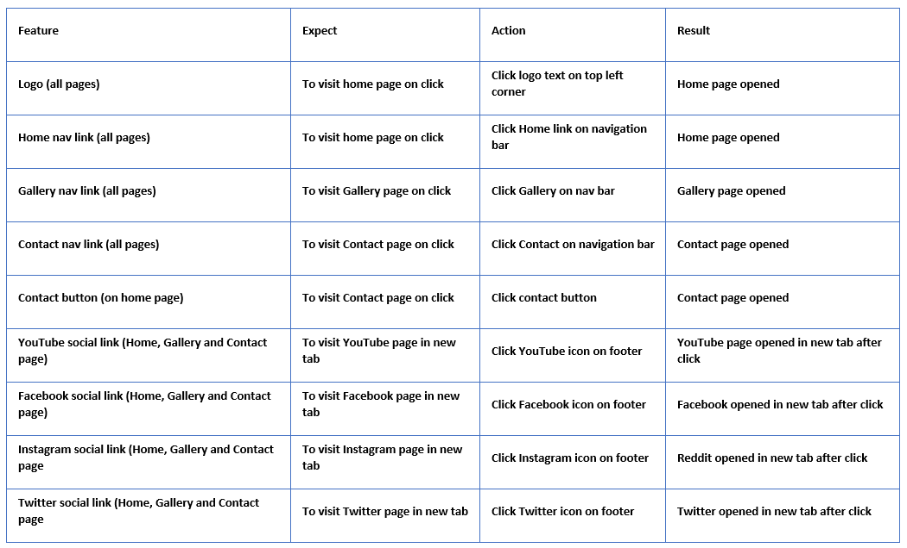
  

 - ### User Story Testing

| User Story                                                                                                  | Screenshot                                         |
| ----------------------------------------------------------------------------------------------------------- | -------------------------------------------------- |
| As a first time visitor, I want to easily understand the main purpose of the site.                          |      |
| As a first time visitor, I want to be able to easily navigate throughout the site to find content.          |         |
| As a first time visitor, I want to be able to easily view a gallery page                                    |    |
| As a first time visitor, I want to be able to easily find how I can get in contact with the business owner. |    |
| As a returning visitor, I want to be able to send a quick feedback to the business owner.                   |       |
| As a returning visitor, I want to be able to check new products images.                                     |  |
| As a returning visitor, I want to be able to contact the business owner through email or phone.             |    |
| As a website administrator, I would like to easy update customer reviews                                    |    |
| As a website administrator, I would like to easy get contacted by email, phone or contact form.             |    |

 - ### Lighthouse test
   
   | Page      | Device  | Screenshot                                                    | Notes                                                                                        |
   | --------- | ------- | ------------------------------------------------------------- | -------------------------------------------------------------------------------------------- |
   | Home      | Mobile  |    | 88 Performance due to time at which the first text or image is painted while on a 3G network |
   | Home      | Desktop | 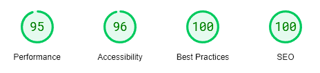  |                                                                                              |
   | Gallery   | Mobile  | 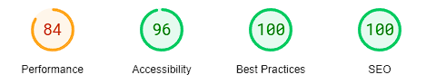    | 84 Performance due to time at which the first text or image is painted while on a 3G network |
   | Gallery   | Desktop | 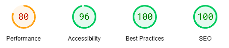   | 80 Performance due to having a image gallery                                                 |
   | Contact   | Mobile  |     | 87 Performance due to time at which the first text or image is painted while on a 3G network |
   | Contact   | Desktop | 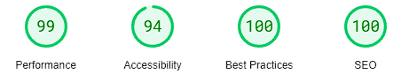   |                                                                                              |
   | Submitted | Mobile  | 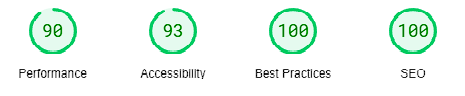  |                                                                                              |
   | Submitted | Desktop | 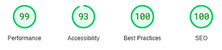 |                                                                                              |

- ### Responsiveness
   - The website was tested on Chrome, Mozilla and Edge browsers with no problems found. The website has been tested on different screen size using Google Chrome developer tool simulating devices like Iphone 12 Pro, Samsung S20 Ultra, Surface Pro 7 and Ipad Air. 

## Deployment

- ### How this site was deployed

- In the GitHub repository, navigate to the Settings tab, then choose Pages from the left hand menu 
- From the source section drop-down menu, select the Master Branch
- Once the master branch has been selected, the page will be automatically refreshed with a detailed ribbon display to indicate the successful deployment
- Any changes pushed to the master branch will take effect on the live project

[View the live project here](https://mariusmilitaru32.github.io/GoodiesByBobo/)

 ## Bugs

First bug was on the left image from home page because had a smaller height than other two. To solve the bug I had to set the  paragraph text under the image to 14px. 
Second bug I had was because of Facebook link from footer was not opening in a new tab. To solve the bug I added taget="_blank" to the href Facebook social icon.

## Unfixed bugs
 - There are not any bugs left that I am aware of.

## Credits
 - Photos downloaded from [Pexels.com](https://www.pexels.com/)
   - header-image.jpg by Pixabay
   - cookie1.jpg by Nicole Michalou
   - cookie2.jpg by Lina Kivaka
   - cookie3.jpg by Nadin Trosh
   - user1.jpg by ibadat singh
   - user2.jpg by Anna Tarazevich
   - rating.jpg downloaded from [pixabay](https://pixabay.com/images/search/star%20rating/)
   - All other images from gallery page have been provided by the business owner.
  - Code 
    - The code for responsive image gallery have been adapted from [Terryl Brown](https://www.youtube.com/watch?v=nEej0A08RYs) youtube channel  
    - Contact form code have been adapted from [w3schools](https://www.w3schools.com/howto/howto_css_contact_form.asp)
     

## Acknowledgements
 - I would like to thank [Nathan Parry_4P_cohort_lead](https://code-institute-room.slack.com/team/U04EX23NTND) for looking at my project and idetifing the image and footer icon bug.
 - I would like to thank [Codeinstitute](https://codeinstitute.net/) slack community for helping me during my project.