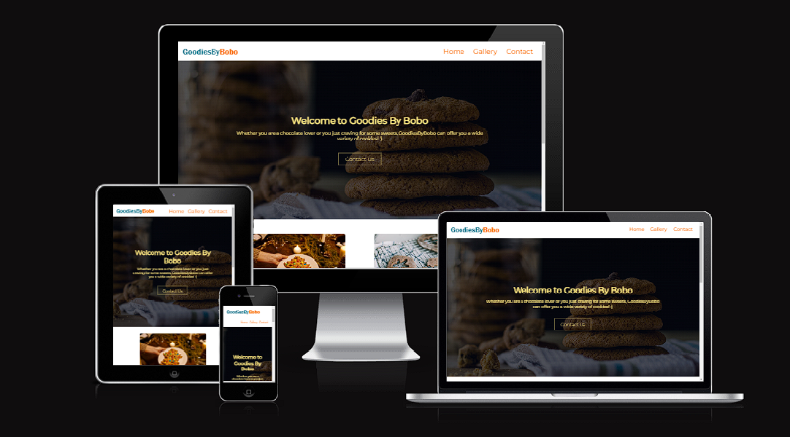
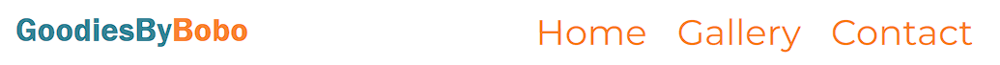
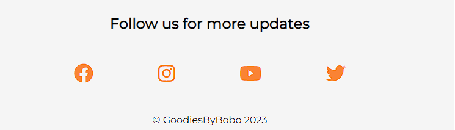
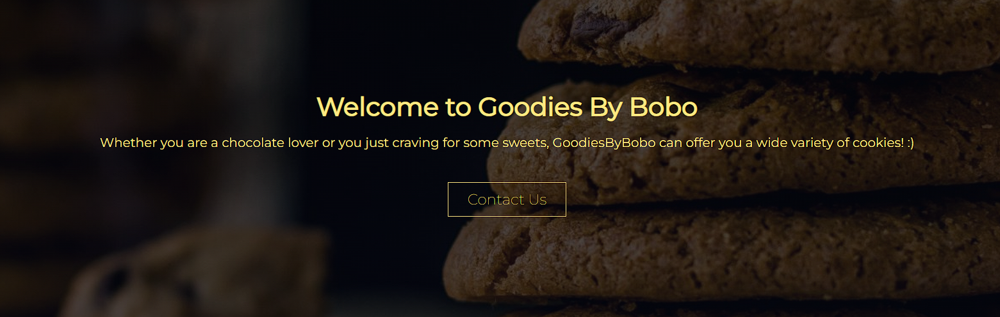
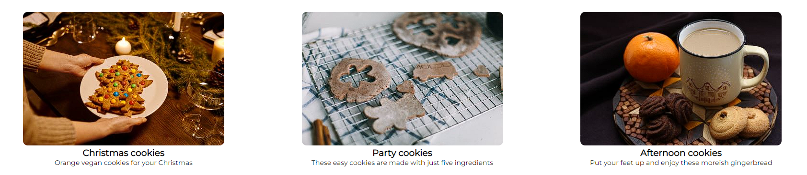
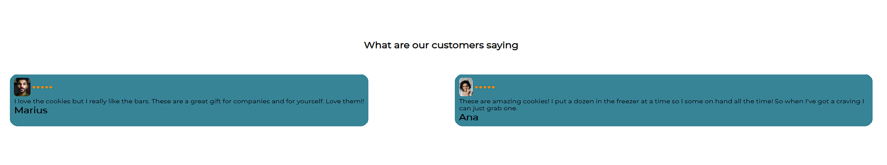
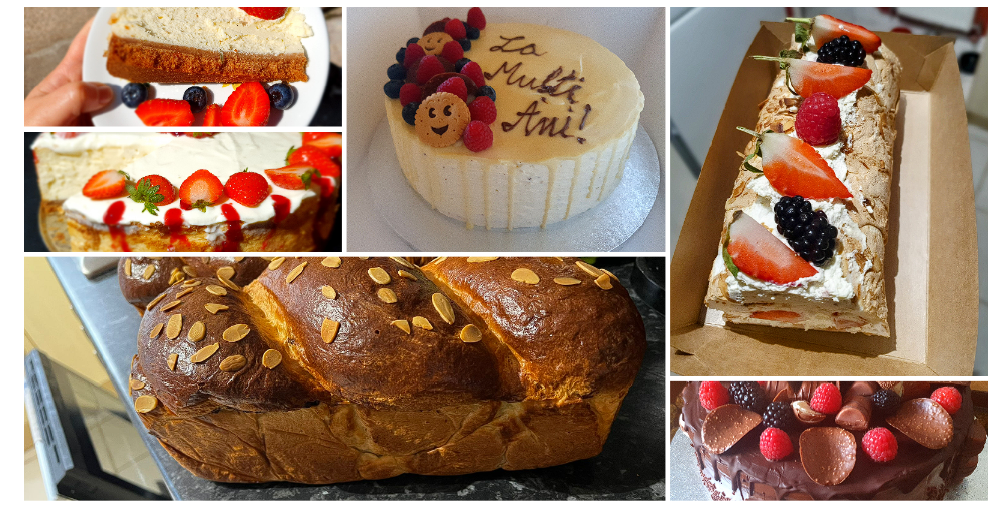

<h1 align="center">GoodiesByBobo Website</h1>

[View the live project here](https://mariusmilitaru32.github.io/GoodiesByBobo/)

GoodiesByBobo is a business that primarly sells home made cookies and cakes.I created a website for my friend's business because I believe in her passion and the quality of her products. As someone who has sampled her delicious cookies firsthand, I know that they are truly exceptional and deserve to be shared with a wider audience. I also believe that a website can help my friend's business stand out in a competitive market. With so many options for consumers to choose from, having a well-designed and user-friendly website can make all the difference in attracting new customers and building brand loyalty.

## Index – Table of Contents
* [User Experience (UX)](#user-experience-ux) 
* [Features](#features)
* [Design](#design)
* [Technologies Used](#technologies-used)
* [Testing](#testing)
* [Deployment](#deployment)
* [Credits](#credits)

## User Experience (UX)

- ### User stories

  -   #### A. First Time Visitor 

        1. As a First Time Visitor, I want to easily understand the main purpose of the site and learn more about the organisation.
        2. As a First Time Visitor, I want to be able to easily navigate throughout the site to find content.
        3. As a First Time Visitor, I want to be able to easily navigate and view a gallery page and customer reviews.
        4. As a First Time Visitor, I want to be able to easily find how I can get in contact with the business owner.

   -   #### B. Returning Visitor 

        1. As a Returning Visitor, I want to be able to send a quick feedback to the business owner.
        2. As a Returning Visitor, I want to be able to check new products images.
        3. As a Returning Visitor, I want to be able to contact the business owner through email or phone.

    -  #### C. Website Administrator
        1. As a website administrator, I would like to easy update new and existing products.
        2. As a website administrator, I would like to easy update customer reviews
        3. As a website administrator, I would like to easy get contacted by email, phone or contact form.
   
## Features

   - ### Navigation bar
     - The navigation bar is an essential component of a website's user interface, as it helps users navigate the site and find the content they are looking for quickly and easily. The navbar consist of logo text and links to all three pages (home,gallery and contact). 
  
  -  ### Footer
     - The footer is present on all three pages and consist of follow us text and four icons linked to the social business accounts, providing users an easy access to the newest updates. 
    
  - ### Home page
    - The home page inludes an hero image with a linear gradient to highlight the welcome text, the business purpose and a contact button to give the user the possibility to contact the business owner
  
    - Products offers can been seen right under hero image where this section contains three collums with images and a short description for each type of product the business can offer.
  
    - Homepage customer reviews section can be found under products offer, they provide a valuabe feedback on the products. They help to establish trust with potential customers and can influence their purchasing decision. 
  
  - ### Gallery Page
    - The gallery page has a simple design with a responsive layout using three breakpoints, starting with three collums for large devices like laptops and wide monitors, two collums for medium devices and one collum for smartphones 
 
  - ### Contact page